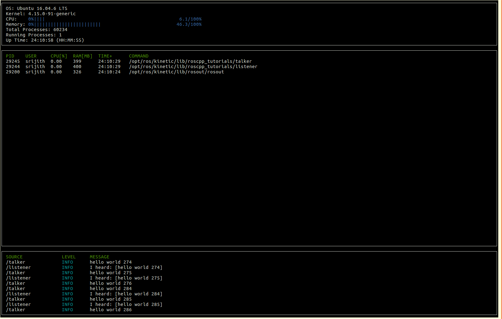

# ``ROS-System-Monitor``

## `Overview`

A C++ program similar to " htop " , to display memory and CPU utilization by ROS process nodes.

The program also displays ROS logging console messages published by various ROS nodes and services running on the ROS master.

`Example Output:`



## `Demo`

### `System Requirements:`
1. [Docker](https://www.docker.com)
2. Linux - tested on Ubuntu Desktop 18.04.4
   * [Docker installation instructions](https://docs.docker.com/install/linux/docker-ce/ubuntu)
3. Windows - tested on Windows 10 Pro version 1909
   * [Docker install download](https://www.docker.com/products/docker-desktop)
   * Docker configured to use Linux containers

## `Instructions`
1. Clone the project repository
```bash
    git clone https://github.com/srijithumakanth/ROS_system_monitor.git
```
2. Build Docker Image
```bash
    cd ROS_system_monitor
    cd Docker
    docker build --tag ros_system_monitor .
``` 
3. Run Docker container from image
   
   #### `Expected Behavior:`
   Container will start the ROS Master, pause for 10 seconds to allow the ROS Master and test nodes to come up, and then start ros_system_monitor.

   ROS node processor's and memory utilization will be displayed.

   Most recent ROS messages from the running nodes will be displayed. Number of messages displayed will depend on available screen space (Automatically set).

   Press `CTRL-C` to close ros_monitor.
```bash
    docker run -it --name ros_system_monitor_test ros_system_monitor
```

4. To clean up after testing
```bash
    docker rm ros_system_monitor_test
    docker rmi ros_system_monitor
```

## `Rubric:`

### `Rubric Criteria Met:`

#### `README (All Rubric Points REQUIRED):`

1. A README with instructions is included with the project.
2. The README indicates which project is chosen.
3. The README includes information about each rubric point addressed.

#### `Compiling and Testing (All Rubric Points REQUIRED):`

1. The submission must compile and run.
    * The code base is compiled as a Docker image and run inside of a Docker Container.

#### `Loops, Functions, I/O:`

1. The project demonstrates an understanding of C++ functions and control structures.
    * Varieties of functions and control structures are used throughout the different Class implementations.

#### `Object Oriented Programming:`

1.  The project uses Object Oriented Programming techniques.
    * Object Oriented Programming is used throughout various Class implementations. 
2. Classes use appropriate access specifiers for class members.
    * Appropiate access specifiers are used throughout various Class implementations.
3. Class constructors utilize member initialization lists.
    * See RosMessageFormat constructor ([rosMessageFormat.cpp](src/rosMessageFormat.cpp), line 5)
4. Classes abstract implementation details from their interfaces.
    * Used throught various Class implementaions.
5. Classes encapsulate behavior.
    * Used throught various Class implementaions.

#### `Memory Management:`

1. The project makes use of references in function declarations.
    * See rosAPI definitons:
    * getROSApiUri ==> ([rosAPI.h](include/rosAPI.h), line 25)
    * getNodePid ==> ([rosAPI.h](include/rosAPI.h), line 31) 

2. The project uses destructors appropriately.
    * RosApi destructor shuts down ROS Master connection ([rosAPI.cpp](src/rosAPI.cpp), line 27)
    
    * NCursesDisplay destructor closes NCurses window ([ncurses_display.cpp](src/ncurses_display.cpp),  line 25). Useful when exception is thrown to prevent leaving console in a bad state.

    * RosMessages destructor to appropiately create a thread barrier. ([rosMessages.cpp](src/rosMessages.cpp), line 13)

3. The project uses scope / Resource Acquisition Is Initialization (RAII) where appropriate.
    * rosAPI acquires connection with ROS Master in constructor and releases connection in destructor.

4. The project follows the Rule of 5.
    * See definitions of rosMessageFormat ([rosMessageFormat.h](src/rosMessageFormat.h), lines 44 - 57)

5. The project uses move semantics to move data, instead of copying it, where possible.
    * Move semantics is used in RosMessages to create instance of RosMessage when message callback is called by ROS subscriber. RosMessage instance is then moved to the queue. Messages to display are moved from that queue to the display queue. Results in one instance of RosMessage created in message callback and then that same instance is moved between receive queue and display queue.
    
    *  Message created in `RosMessages::rosAggCallback` and then moved to queue (`rosMsgs_`) ([rosMessages.cpp](src/rosMessages.cpp), line 79)
    
    * Message instance moved from receive queue to display queue (`displayedRosMsgs_`) `RosMessages::getMsgsToDisplay()` ([rosMessages.cpp](src/rosMessages.cpp), line 67)

#### `Concurrency:`

1. The project uses multithreading.
    * RosMessages creates thread to subscribe to messages from ROS Master ([rosMessages.cpp](src/rosMessages.cpp), line 7)

2. A mutex or lock is used in the project.
    * RosMessages uses mutex and lock (`std::lock_guard`) to protect access to receive queue ([rosMsgs_](src/rosMessages.cpp), line 61), as queue is accessed from subscriber thread and display thread.

    * Display queue in RosMessages is only used in the display thread and does not need a mutex.

